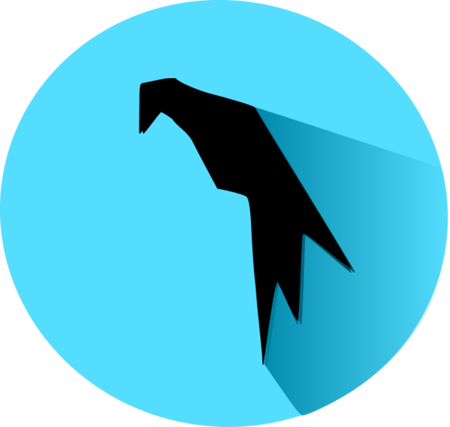

### Hi there 👋, my name is Hasan Mozumder
#### Cybersecurity and DevOps Engineer

I am passionate about building interactive chatbots using NLP techniques and implementing Object Detection API for cutting-edge applications. Additionally, I excel in developing IoT solutions to drive transformative innovation. Manipulating my experience as a cybersecurity professional, I have conducted thorough vulnerability assessments and penetration testing to identify and address potential weaknesses in systems and networks.

Skills: Python / Django / Flask / Docker / SIEM Framework / SQL / HTML / CSS

- 🔭 I’m currently working on Cybersecurity 
- 🌱 I’m currently learning SIEM Framework and CI/CD 
- 👯 I’m looking to collaborate on Linkedin 
- 🤔 I’m looking for help with Google cybersecurity professional 
- 💬 Ask me about Cybersecurity or Python
- 📫 How to reach me: Email or Linkedin 

<h2 align="left" id="macropower-tech">Favorite Tech</h2>

> Tools, languages, and other things that I like to work with.

<table>
  <tr>
    <td align="center" width="96">
      
       Python
    </td>
    <td align="center" width="96">
      
       Django
    </td>
    <td align="center" width="96">
      
       Flask
    </td>
    <td align="center" width="96">
      
       SIEM
    </td>
    <td align="center" width="96">
      
       BurpSuit
    </td>
        <td align="center" width="96"> 
      
       Docker
    </td>
    <td align="center" width="96">
      
       Kubernetes
    </td>
    <td align="center" width="96"> 
      
       ParrotOS
    </td>
    <td align="center"  width="96">
      
       Kali Linux
    </td>

  </tr>
</table>

    

  
